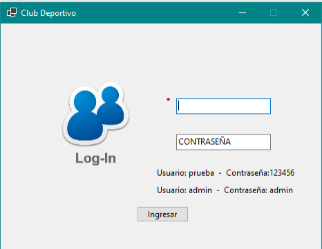
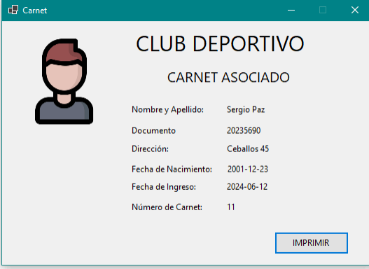
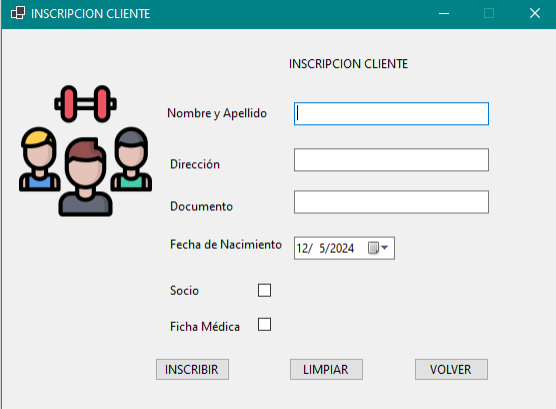
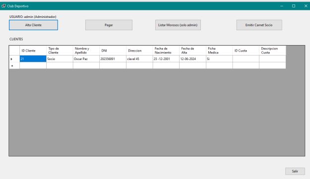
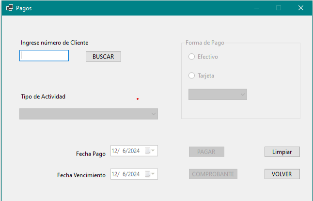

# 🖥️ Gestión Club Deportivo - Desktop Edition
> **Proyecto Desarrollo de Sistemas Orientado a Objetos - Tecnicatura Superior en Desarrollo de Software (IFTS 29)**

##  Información del Proyecto
Este sistema representa un desarrollo integral en el entorno de escritorio, diseñado para automatizar la administración de socios y actividades en un club deportivo. 

* **Repositorio Original:** [TDS-IFTS29/Club-Deportivo](https://github.com/TDS-IFTS29/Club-Deportivo)
* **Equipo de Desarrollo (El Quinto Elemento):**
    * **Antonio Gill**
    * **Cristian Descosido**
    * **Damián Andrés Clausi**

---

##  Funcionalidades Principales
El software resuelve la gestión operativa diaria mediante las siguientes herramientas:
* **Administración de Socios:** CRUD completo para el registro y actualización de miembros.
* **Gestión de Cobranzas:** Módulo para el control de pagos y estados de deuda.
* **Inscripción a Actividades:** Control de cupos y asignación de socios a disciplinas.
* **Persistencia de Datos:** Manejo de base de datos local para garantizar la integridad de la información.

---

##  Stack Tecnológico
* **Lenguaje:** C#
* **Framework:** .NET (Windows Forms)
* **Arquitectura:** Diseño orientado a objetos con separación de responsabilidades.
* **Base de Datos:** MySQL
---

##  Vista previa

---

